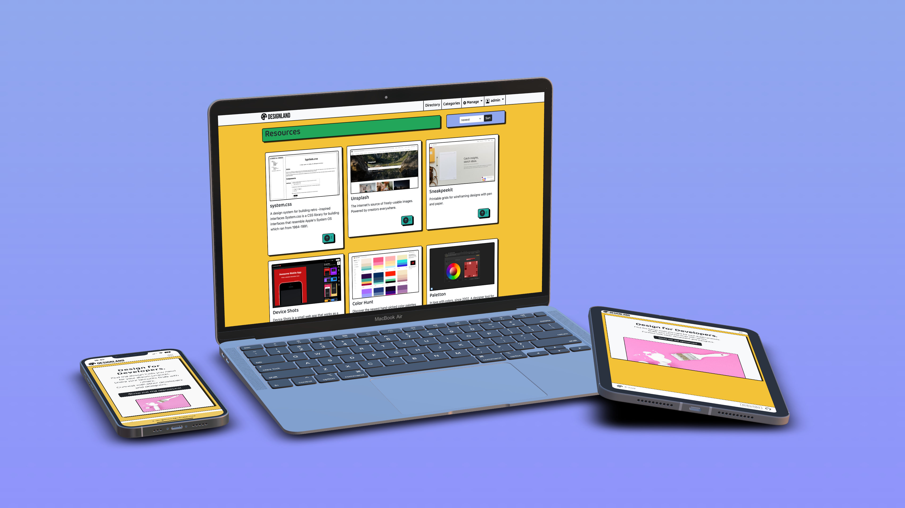
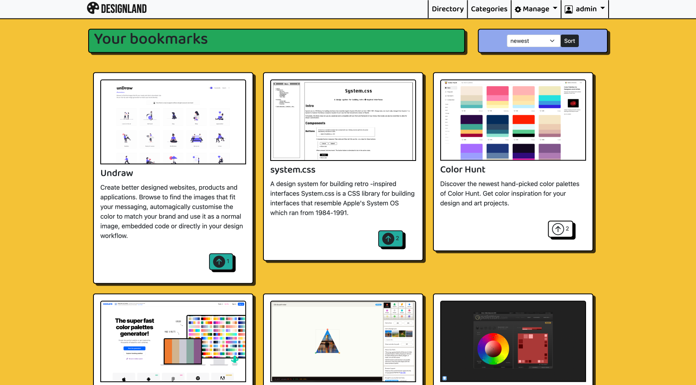
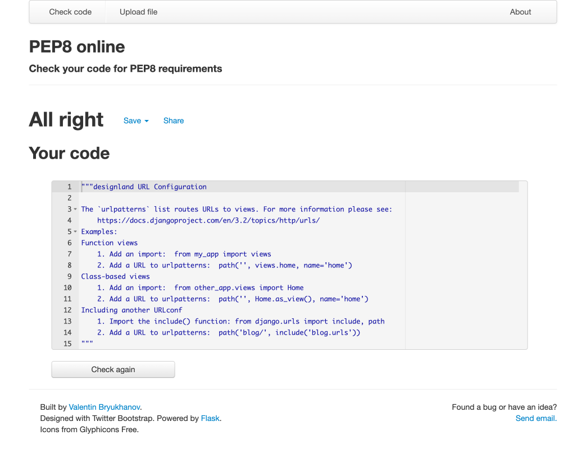

# designland

[](https://designland.herokuapp.com/)
[](https://designland.herokuapp.com/)


## Table of Contents


## Introduction

The project is an online directory of useful design resources for web developers and designers.

Users can register to submit resources to the directory, and upvote and bookmark resources they find useful.

The project was built keeping the Agile management principles in mind, and I utilised many of GitHub's features such as Issue and Projects to implement Scrum methodology.

[Kanban Board for project](https://github.com/users/davidindub/projects/7/)

[Closed Issues on GitHub for the project](https://github.com/davidindub/designland/issues?q=is%3Aissue+is%3Aclosed)

I used [GitHub issues](https://github.com/davidindub/designland/issues) for the product backlog containing the user stories. Issues were also used for bug reports so I could keep track of tricky bugs over time.

CRUD functionality
- Users can read all approved resources, and create, update and delete resources they contributed.
- Users can create, update, read and delete their accounts/profiles.
- Admins can create, read, update and delete all resources.

<details>
<summary>Screenshot of the product backlog</summary>


</details>


I used the tags feature in GitHub Issues for assigning story points, prioritising features based on [the MoSCoW method](https://en.wikipedia.org/wiki/MoSCoW_method), and categorising the user stories.

I used the [Milestones feature](https://github.com/davidindub/designland/milestones) to plan sprints and set deadlines.


I took the [Agile Foundations](https://www.linkedin.com/learning/agile-foundations/) course on LinkedIn Learning to better understand the difference between Agile and Scrum.


## User Stories

User stories were prepared using GitHub Issues and assigned story points based on estimated completion time.

User Stories can been seen below under [User Story Testing](#user-story-testing), and in the [GitHub Issues](https://github.com/davidindub/designland/issues?q=is%3Aissue+is%3Aclosed) for full details including screenshots, story points and associated sprints.


## UX  

As the project is a directory of design resources, I wanted to try something fun and bold with the design and was inspired by the trend for neubrutalism web design, and websites such as [Gumroad](https://gumroad.com/) and [Google I/O 2022](https://io.google/2022/).


- [Qode Magazine - 60 Best Examples of Brutalism in Web Design](https://qodeinteractive.com/magazine/best-examples-of-brutalism-in-web-design/)
- [Elementor Blog - What Is Brutalism in Web Design?](https://elementor.com/blog/brutalism-in-web-design/)


### Typography

- A display font called [Bebas Neue](https://fonts.google.com/specimen/Bebas+Neue?query=bebas) was used for the logo as it fitted the neubrutalist theme of the site.

- [Baloo 2](https://fonts.google.com/specimen/Baloo+2?query=baloo) contrasts the harsh lines of the display font with friendlier rounded letters that made it suitable for the headings and navbar.


### Wireframes


## Accessibility

I ensured that despite bold use of color, every element still met AAA level in the [Web Content Accessibility Guidelines](https://www.w3.org/WAI/WCAG2AAA-Conformance) (WCAG).

Buttons featuring icons have appropriate `aria-labels`, and notification messages have `aria-live` tags and are read by screen readers.

I tested navigating the project with VoiceOver on macOS.

## Database Design

I used the desktop version of [diagrams.net](https://app.diagrams.net/) to design the models. I created a Profile model to associate extra information with users not included in the default Djano user model. 


After creating the Profile model I used this script in the terminal to create a profile for existing users in the database that didn't have one yet:


```
>>> from django.contrib.auth.models import User
>>> from directory.models import Profile
>>> users = User.objects.filter(profile=None)
>>> for user in users:
...     Profile.objects.create(user=user)
```


## Features 


## Existing Features

### Landing Page

A simple landing page explains the project and features a call to action button to lead the user to the main content.

<details>
<summary>Landing Page Screenshot</summary>


</details>


### Navbar

The Navbar is responsive and collapses to a hamburger menu on smaller devices. On larger screen it sticks to the top when the page is scrolled.

When a user is logged in, their username is displayed in the navbar, and a dropdown menu includes:
- My Profile (link to the user's own profile)
- My Bookmarks (list of the resources the user has bookmarked)
- My Submissions (list of approved resources the user has submitted)
- Submit New Resource (form to submit a new resource)
- Logout

When a staff member is logged in, an extra Manage dropdown option is shown which includes:
- Unapproved Resources (submissions not yet visible on the site ready for screening)
- User List (a list of all registered users on the site)
- Django Admin Panel (a link to the Django Administration Panel)

<details>
<summary>Nav Bar Screenshots</summary>


Navbar as viewed by logged in admin.


Navbar as viewed by logged in admin (mobile).

</details>


### Directory & Categories

The list of design resources. Directory lists all resources, while Categories lets users sort by tag.

Users can sort the list by newest, oldest or most up-voted.

The list page is also used for seeing all the resources a user has added via their profile.

<details>
<summary>Screenshot of Categories page listing all tags</summary>


</details>


### Register / Login

Users can either sign up using their Google or Github account, or directly on the site.

GitHub was chosen as the site is aimed at developers and designers, and Google as is has 1.8 billion active montly users.

Users who have previously registered with GitHub or Google can easily sign in again with one click.


<details>
<summary>Register / Login Screenshots</summary>


Register a new Account


Register a new Account - pick username (after authorising Google account)


Login

</details>

### Upvoting

Users can upvote the resources they like, other users will see the total number of uploads and can view the most popular resources on the site.

<details>
<summary>Most Popular page Screenshots</summary>


Resources listed by number of upvotes

</details>

### Tags

Users can add tags their submissions which are used to categorise the entries. Suggested tags are show on the submission page.


### Bookmarks

Users can bookmark resources they find useful in list that only they can see.

<details>
<summary>Screenshot of Bookmarks List</summary>



</details>

### User Profiles

Users can display links to their Personal Website, GitHub profile and Twitter profile

A list of all the resources the user has contributed is shown on their page.

When a logged in user views their own profile, they can click a button to edit it. The user can delete their account from this page too if they choose.

<details>
<summary>User Profile Screenshots</summary>


Profile Page as a guest


Own Profile Page as a logged in user, showing Edit Profile button.


</details>


### Submit Resources to Directory

Users can submit a resource to the directory by providing a Title, URL, Description, and Tags describing the resource.

A placeholder thumbnail is added to the Resource on submitting.

When a user submits a resource to the directory, they can see a preview of it which they can edit again, and a badge telling them it is awaiting approval by a staff member.

<details>
<summary>A resource with awaiting approval badge</summary>


As viewed by a staff member.
</details>

Submissions will be manually approved by staff members to prevent unwanted material being posts, and to ensure a high standard of resources in the directory.


### Footer

The Footer includes:
- A link back to the homepage
- Copyright information
- A link to the Privacy Policy
- A link to the [GitHub repository for the project](https://github.com/davidindub/designland).

### Privacy Policy

As the project can collect data from users, I included a Privacy Policy link in the Footer which explains how data may be used. I used [GDPR.eu](https://gdpr.eu/) for help writing the policy.

See:
[Writing a GDPR-compliant privacy notice (template included)](https://gdpr.eu/privacy-notice/)

### Notifications

Django Messages and Bootstrap's Toast elements were combined to make elegant notification messages when the user performs actions such as signing in/out and bookmarking or upvoting a resource. Staff also see notifications for things like approving/hiding/deleting resources. The notifications appear on the bottom right so as not to cover the navigation bar.

<details>
<summary>Animated screenshot showing notifications</summary>


Notifications for upvoting / removing upvote / logging out in action

</details>

### Staff Only Features

The Manage dropdown menu in the nav bar appears only for logged in staff members and features additional pages.

#### Unapproved Resources

All unapproved resources that have been submitted by registered users. Staff members can approve, edit, or delete them.

#### User List

A list of all registered users of the site along with the date they joined, number of contributions, and total upvotes recieved.

The Manage menu also features a link to the Django admin panel should it be needed for features not yet implemented directly in the project. (such as managing tags).

<details>
<summary>Screenshot of User List</summary>


</details>


### Custom Error Pages

Custom error pages were added for 403, 404, and 500 errors.

<details>

<summary>Screenshot of 500 Error Message</summary>


</details>

***


### Features Left to Implement

- Currently the screenshot thumbnails for the site are manually uploaded to Cloudinary by an administrator, but I would love to add an API such as [URL2PNG](http://url2png.com/) in future to automate the process, however it was difficult to find a free service for this project.

- With Heroku ending free plans in November 2022, the project will be redeployed on a different cloud platform in future. This was only announced when nearing the final sprint and the project continued as planned for the submission deadline,.


## Technologies Used

- [Python](https://www.python.org/)
- [pip](https://pip.pypa.io/en/stable/) for installing Python packages.
- [Git](https://git-scm.com/) for version control.
- [GitHub](https://github.com/) for storing the repository online during development.
- GitHub Projects was invaluable throughout the project and helped me keep track of things to do and bugs to fix - you can see [the project's board here](https://github.com/users/davidindub/projects/7).
- [GitPod](https://gitpod.io/) as a cloud based IDE.
- [Balsamiq](https://balsamiq.com/wireframes/) for wireframing.
- [Bootstrap 5](https://getbootstrap.com/) as a front end framework.
- [Google Chrome](https://www.google.com/intl/en_ie/chrome/), [Mozilla Firefox](https://www.mozilla.org/en-US/firefox/new/) and [Safari](https://www.apple.com/safari/) for testing on macOS Monterey.
- [Microsoft Edge](https://www.microsoft.com/en-us/edge) for testing on Windows 11.
- [Safari](https://www.apple.com/safari/) on iOS and iPadOS 15.
- [Google Chrome](https://www.google.com/intl/en_ie/chrome/) on Android 12.
- [diagrams.net](https://www.diagrams.net/) for drawing database diagrams.
- [favicon.io](https://favicon.io/favicon-generator/) to make a favicon for site.
- [Device Frames](https://deviceframes.com/) for the device mockups in this README.
- [Meta Tags](https://metatags.io/) to prepare the Meta tags for social media share previews.

## External Python Packages Used

- [django-taggit](https://github.com/jazzband/django-taggit) for tags on directory entries
- [django-crispy-forms](https://pypi.org/project/django-crispy-forms/) for help styling the forms
- [crispy-bootstrap5](https://pypi.org/project/crispy-bootstrap5/) for Bootstrap 5 templates for django-crispy-forms


## Testing 

I performed manual testing continously as the project was being developed, and filed [bug reports on GitHub](https://github.com/davidindub/designland/issues?q=is%3Aissue+is%3Aclosed+label%3Abug) as issues were discovered to keep track of bugs. I kept track of how to recreate bugs, expected behaviour, screenshots of the issue and how it was resolved to help myself in future.

I asked friends to test registering accounts / submitting resources / deleting accounts in different ways (email registration, Google registration, GitHub registration, registration with no email, etc.) to try and catch any potential issues.

### User Story Testing

<details>
<summary>As a first time visitor I want to be greeted with a clear explanation of the site so that I know what it is about</summary>

### Acceptance Criteria

- If I visit the homepage I am greeted with a eye catching slogan/hero image
- I should be able to tell the purpose of the site easily

**Result:** ✅ Pass
</details>

<details>
<summary>
As a visitor to the site I want to read the Privacy Policy before I sign up so that I can know how my data will be used
</summary>

### Acceptance Criteria

- I can click a link to be taken to the Privacy Policy
- The policy is written in easy to understand language 

**Result:** ✅ Pass
</details>

<details>
<summary>As a registered user I want to update my profile page so that people can find me on Twitter / GitHub</summary>


### Acceptance Criteria

- I can add Twitter/GitHub links to my profile
- I can delete my account

**Result:** ✅ Pass
</details>

<details>
<summary>As a developer I want to register using my Github account so I can signup without filling in any forms</summary>


### Acceptance Criteria

- I chose to sign up with Github
- An account is created automatically for me

**Result:** ✅ Pass
</details>

<details>
<summary>As I user I want to share the site on social media to help my designer friends find cool new stuff</summary>

### Acceptance Criteria

- If I share the site on Facebook/Twitter etc.
- A thumbnail/logo and the right meta data describing the site should appear in the preview card

**Result:** ✅ Pass
</details>

<details>
<summary>As a user I want to see all the resources I have submitted so I can see all my submissions in once place</summary>


### Acceptance Criteria

- I should be able to see all the resources I have submitted
- I can see the resources added by other users on the site too

**Result:** ✅ Pass
</details>

<details>
<summary>As a user I want to be able to see a list of tags on each resource so I know what category it belongs to</summary>

### Acceptance Criteria

- Each resource page should list tags categorising the resource

**Result:** ✅ Pass
</details>

<details>

<summary>As a user I can view a paginated list of resources so that I can select one to read and not have too many displayed at once</summary>

### Acceptance Criteria

- When there is many resources, they should be split onto separate paginated pages

**Result:** ✅ Pass
</details>

<details>
<summary>As a unregistered developer/designer I want to browse the directory so I can find useful resources for building my projects</summary>

### Acceptance Criteria

- If I visit the site I should see a list of design resources
- I can click them to be taken to the resource

**Result:** ✅ Pass
</details>

<details>

<summary>As an administrator I want to manually approve or deny user submitted resources so I can moderate the directory and keep it free of spam or abusive messages</summary>


### Acceptance Criteria

- If a user posts a Resource it appears in the admin panel for approval
- As an admin, I can approve or deny the Resource for publication

**Result:** ✅ Pass
</details>

<details>

<summary>As a user I want to be able to click other users names to see what other resources they have added to the directory</summary>

### Acceptance Criteria

- I can click a username to be taken to their page
- On their page I can see all the resources they have added to the directory

**Result:** ✅ Pass
</details>

<details>

<summary>As a user I want to add links to my GitHub/Twitter/Portfolio website* so I can gain new followers</summary>

### Acceptance Criteria

- I can add a link to my website/GitHub/Twitter to my profile
- It appears on my profile page


**Result:** ✅ Pass
</details>

<details>
<summary>As a user I can click on a thumbnail so that I can view a page with the full details of the resource</summary>

### Acceptance Criteria

- If I click a resource in the lists, I am taken to a page with full details about it

**Result:** ✅ Pass
</details>

<details>

<summary>As an administrator I want to be able to add, edit and remove resources so I can curate the listings</summary>

### Acceptance Criteria

- If a user submits a link, I can approve or deny
- If I approve it, it appears publicly on the site
- I should be able to delete previously approved resources too


**Result:** ✅ Pass
</details>

<details>
<summary>As a user I want to be able to see a thumbnail of the site so I can preview it before clicking</summary>

### Acceptance Criteria

- I should see thumbnails of each resource 
- When I click the thumbnail it takes me to the page of the resource

**Result:** ✅ Pass
</details>

<details>

<summary>As a user I want to be able to sort the resources by tag so I can find what I'm interested in</summary>


### Acceptance Criteria

- I should be able so view the listed resources tag by tag
- When I select a tag, only resources with that tag are listed

**Result:** ✅ Pass
</details>

<details>
<summary>As a registered user I want to be able to add useful resources I've discovered to the site so I can share them with the community</summary>

### Acceptance Criteria

- I should be able to add resources to the site


**Result:** ✅ Pass
</details>

<details>

<summary>As a user I want to be able to upvote resources so I can participate and recommend resources to others</summary>


### Acceptance Criteria

- I can click a button to upvote resources
- The number of upvotes should increase
- Resources are listed by number of upvotes

**Result:** ✅ Pass
</details>

<details>

<summary>As a user I want to be able to bookmark resources so that I can view a list of my favourites in future</summary>

### Acceptance Criteria

- I can click a bookmark icon next to each resources
- The resource should be added to my list of bookmarked resources
- I can visit a page where I can see all my bookmarked resources

**Result:** ✅ Pass
</details>

<details>
<summary>As a user, I want to be able to register for an account so I can interact with the site</summary>


### Acceptance Criteria

- I should be able to browse without logging in.
- I should be able to register for an account using Google OAuth

**Result:** ✅ Pass
</details>


### Challenges Faced

`django-taggit` was the source of a few bugs encountered in development. In a future project I may just model my own tags in the database.

<details>
<summary>django-taggit bug screenshot</summary>

</details>

While Bootstrap was good for getting a responsive design up and running quickly, I found using Bootstrap classes for things like layout very frustrating when combined with Django templating. In future I would consider not using Bootstrap at all, or writing more custom classes instead of using Bootstrap layout classes that need to be changed in many places.


### Code Validation

#### HTML Validation

Pages were validating using the [W3 HTML Validator](https://validator.w3.org/nu/), and pages with content that varies based on guest/logged in user/admin status were validated in each state.

| Page                | URL                | Logged In Status | Result                |
|---------------------|--------------------|------------------|-----------------------|
| Landing Page        | /                  | Guest            | [✅ No errors or warnings](https://validator.w3.org/nu/?doc=https%3A%2F%2Fdesignland.herokuapp.com%2F) |
| Landing Page        | /                  | User             | [✅ No errors or warnings](docs/images/testing/html/w3-html-testing-landing-page-as-user.png) |
| Landing Page        | /                  | Admin            | [✅ No errors or warnings](docs/images/testing/html/w3-html-testing-landing-page-as-admin.png) |
| Directory           | /list/             | Guest            | [✅ No errors or warnings](https://validator.w3.org/nu/?doc=https%3A%2F%2Fdesignland.herokuapp.com%2Flist%2F) |
| Directory           | /list/             | User             | [✅ No errors or warnings](docs/images/testing/html/w3-html-testing-directory-as-user.png) |
| Directory           | /list/             | Admin            | [✅ No errors or warnings](docs/images/testing/html/w3-html-testing-directory-as-admin.png) |
| Categories          | /alltags/          | Guest            | [✅ No errors or warnings](https://validator.w3.org/nu/?doc=https%3A%2F%2Fdesignland.herokuapp.com%2Falltags%2F) |
| Categories          | /alltags/          | User             | [✅ No errors or warnings](docs/images/testing/html/w3-html-testing-categories-as-user.png) |
| Categories          | /alltags/          | Admin            | [✅ No errors or warnings](docs/images/testing/html/w3-html-testing-categories-as-admin.png) |
| User Profile        | /user/admin/       | Guest            | [✅ No errors or warnings](https://validator.w3.org/nu/?doc=https%3A%2F%2Fdesignland.herokuapp.com%2Fuser%2Fadmin%2F) |
| User Profile        | /user/admin/       | User             | [✅ No errors or warnings](docs/images/testing/html/w3-html-testing-user-profile-as-user.png) |
| User Profile        | /user/admin/       | Admin            | [✅ No errors or warnings](docs/images/testing/html/w3-html-testing-user-profile-as-admin.png) |
| Add New Resource    | /add/              | User             | [✅ No errors or warnings](docs/images/testing/html/w3-html-testing-add-resource-as-user.png) |
| Add New Resource    | /add/              | Admin            | [✅ No errors or warnings](docs/images/testing/html/w3-html-testing-add-resource-as-admin.png) |
| Login               | /accounts/login/   | Guest            | [✅ No errors or warnings](https://validator.w3.org/nu/?doc=https%3A%2F%2F8000-davidindub-designland-4lnvj9ynh6j.ws-eu64.gitpod.io%2Faccounts%2Flogin%2F) |
| Log Out             | /accounts/logout/  | User             | [✅ No errors or warnings](docs/images/testing/html/w3-html-testing-logout-as-user.png) |
| Register            | /accounts/signup/  | Guest            | [✅ No errors or warnings](https://validator.w3.org/nu/?doc=https%3A%2F%2Fdesignland.herokuapp.com%2Faccounts%2Fsignup%2F) |
| Privacy Policy      | /privacy/          | User             | [✅ No errors or warnings](https://validator.w3.org/nu/?doc=https%3A%2F%2Fdesignland.herokuapp.com%2Fprivacy%2F) |
| User List           | /manage/users/     | Admin            | [✅ No errors or warnings](docs/images/testing/html/w3-html-testing-user-list-as-admin.png) |
| Update User Profile | /user/admin/update | Admin            | [✅ No errors or warnings](docs/images/testing/html/w3-html-testing-update-profile-as-admin.png) |

#### Python

All the custom Python files pass PEP8 Validation, which I checked both in the development environment and on [PEP8 online](http://pep8online.com/).

`# noqa` was used in `settings.py` where linebreaks would have broken Django functionality.

<details>

<summary>PEP8 Online Validation - designland/settings.py</summary>


✅ Pass

</details>

<details>

<summary>PEP8 Online Validation - designland/urls.py</summary>



✅ Pass

</details>

<details>

<summary>PEP8 Online Validation - designland/settings.py</summary>


✅ Pass

</details>

<details>

<summary>PEP8 Online Validation - directory/admin.py</summary>


✅ Pass

</details>

<details>

<summary>PEP8 Online Validation - directory/forms.py</summary>


✅ Pass

</details>

<details>

<summary>PEP8 Online Validation - directory/models.py</summary>


✅ Pass

</details>

<details>

<summary>PEP8 Online Validation - directory/urls.py</summary>


✅ Pass

</details>

<details>

<summary>PEP8 Online Validation - directory/views.py</summary>


✅ Pass

</details>


#### JavaScript

Very little custom JavaScript was used with most of the functionality coming from Bootstrap. The two JS files I wrote were validated using [JSHint](https://jshint.com/).

<details>
<summary>JSHint validation screenshot</summary>


</details>


***


## Deployment

### Local Deployment


In order to make a local copy of this project, you can clone it. In your IDE Terminal, type the following command to clone my repository:

- `git clone https://github.com/davidindub/designland.git`


Alternatively, if using Gitpod, you can click below to create your own workspace using this repository.

[](https://gitpod.io/#https://github.com/davidindub/designland)

***

After cloning or opening the repository in Gitpod, you will need to:

1. Create your own `env.py` files in the root level of the project:

```
os.environ["DATABASE_URL"] = "postgres://"
os.environ["SECRET_KEY"] = "YOUR_DJANGO_SECRET_KEY"
os.environ["CLOUDINARY_URL"] = "cloudinary://YOUR_CLOUDINARY_URL"
os.environ["HEROKU_HOSTNAME"] = "URL_OF_PROJECT_DEPLOYED_ON_HEROKU"
os.environ["DEVELOPMENT"] = "True"
```
**Ensure the `env.py` file is added to your `.gitignore` file so it doesn't get pushed to a public repository.

If you don't have a Cloudinary account already, you will need to [Sign Up for Free](https://cloudinary.com/users/register/free) to host the static files in the project.

2. Run `pip3 install -r requirements.txt` to install required Python packages.

3. Migrate the database models using:
`python3 manage.py migrate`

4. Create a superuser with your own credentials:
`python3 manage.py migrate`

5. Run the Django sever:
`python manage.py runserver`
The address of the server will appear in the terminal window.
Add /admin to the address to acces the Django admin panel using your superuser credentials.

### Heroku Deployment
<details>

<summary>
Full Instructions on deploying to Heroku
</summary>

Sign up to [Heroku](https://heroku.com/) for free if you don't already have an account.

1. Create a new app in Heroku.

2. In the Resources tab of your app in the Heroku dashboard, click Add-Ons and select Heroku Postgres. Select Hobby Dev - Free as your plan.

3. When Heroku Postgres is installed, click the Settings tab in the Heroku Dashboard.
Click Reveal Config Vars, and add the same variables from your `env.py` file here, except for `DEBUG`, as you don't want debug mode on the deployed project.

4. Copy the value of `DATABASE_URL` from the Config Vars. In your `settings.py` file, comment out the default database configuration, and add a new one with the Postgres url.

```
DATABASES = {
    'default': dj_database_url.parse('your DATABASE_URL here'))
}
```

5. Migrate the database models using:
`python3 manage.py migrate`

6. Create a superuser with your own credentials:
`python3 manage.py migrate`

7. Create a file called `Procfile` (no extension) containing the following:
```
web: gunicorn designland.wsgi
```

8. Run `pip3 install -r requirements.txt` to install required Python packages.

9. Add the url of your Heroku app (for example 'designland.herokuapp.com') to your `env.py` file in the local deployment, and to the Config Vars in your Heroku deployment.

10. Disable collect static so that Heroku doesn't try to collect static files when you deploy by typing the following command in the terminal

```
heroku config:set DISABLE_COLLECTSTATIC=1
```

11. Stage and commit your files to GitHub
```
git add . 
git commit -m "Commit message"
git push
```

12. In the Heroku dashboard for your App, select Deploy.
Under Deployment Method, choose GitHub and search for your repository and click Connect.

13. Select Enable Automatic Deployments, and then Deploy Branch. Heroku will build the App from the branch you selected.

14. Now whenever you push your commits to GitHub, Heroku will rebuild the application.

</details>


### django-aullauth Setup

You need to use your own [Google Cloud](https://cloud.google.com/) and [GitHub Developer](https://docs.github.com/en/developers) credentials to set up `django-allauth`.

The [django-allauth documentation](https://django-allauth.readthedocs.io/en/latest/providers.html) provides instructions for how to complete setup in your Google Cloud Console / GitHub settings.

*** 

## Credits 

### Content 
- [Writing a GDPR-compliant privacy notice (template included)](https://gdpr.eu/privacy-notice/)
- [OrdinaryCoders - Django custom user profile](https://ordinarycoders.com/django-custom-user-profile) was really helpful for the script to create profiles for existing users.


### Media

- [Bootstrap Icons](https://icons.getbootstrap.com/) were used extensively in the project.
- [Zuzana](https://unsplash.com/photos/B6EOE4ouiAc?utm_source=unsplash&utm_medium=referral&utm_content=creditShareLink) on [Unsplash](https://unsplash.com/) for the paintbrush hero image.


### Acknowledgements

- Thank you to my CI Mentor [Tim Nelson](https://github.com/TravelTimN) for his help and suggestions.
- Thanks to my partner David for his constant support on my journey to a new career.